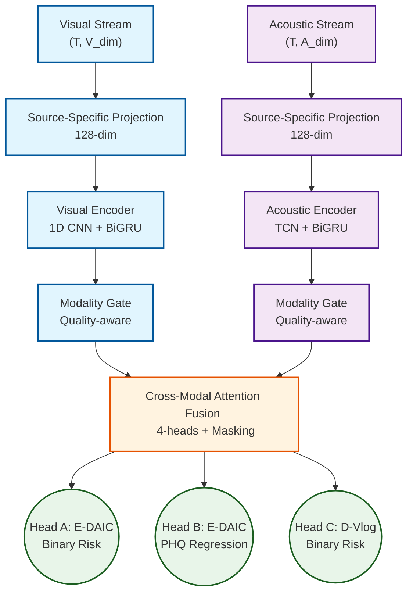

<div align="center">

# 🧠 Multimodal Depression Detection AI
**Real-time Behavioral Screening & Risk Estimation System**

[](https://www.python.org/)
[](https://pytorch.org/)
[](https://fastapi.tiangolo.com/)
[](https://opensource.org/licenses/MIT)

*An advanced multi-task, quality-aware multimodal deep learning architecture designed for behavioral screening support using facial and acoustic features.*

---

</div>

## 📖 Overview

This repository contains the ongoing implementation and architectural plans for a **Multimodal AI System** designed to estimate depression risk via non-invasive behavioral signals. By leveraging high-dimensional facial expressions (facial landmarks, pose, gaze) and acoustic features, this predictive deep learning pipeline delivers real-time inference suitable for clinical screening augmentation.

**Core Datasets integrated:**
- **E-DAIC:** Highly controlled clinical interviews (PHQ-8 Continuous + Binary labels).
- **D-Vlog:** "In-the-wild" YouTube vlogs highlighting continuous speech and behavior (Binary labels).

> **Disclaimer:** This tool acts as a **behavioral screening support system** and is strictly not a clinical diagnostic instrument. 

---

## 🏗 System Architecture

The core of the system relies on a **Source-Aware Multimodal Transformer** that applies quality-aware modality gating before fusing the features through cross-modal attention.



---

## 🚀 Key Features

### 1. Robust Multimodal Architecture
- **Missing Modality Masking:** Models can seamlessly ingest unimodal inputs when either facial tracking or audio streams drop below the minimum confidence threshold in real-time.
- **Quality-Aware Gating:** Automatically down-weights unreliable streams via dynamically computed confidence scores (e.g. MediaPipe tracker uncertainty, poor VAD confidence).

### 2. Advanced Multi-Task Learning Strategy
- Co-trains both datasets using a unique Multi-Task Loss methodology `L = α(L_binary_edaic) + β(L_phq_regression) + γ(L_binary_dvlog)`.
- Custom focal loss down-weights overwhelmingly clear samples, fixing inherent data class biases.

### 3. Sub-Second Real-Time Inference (Live Dashboard)
- **Live Overlays:** Smooth feature tracking overlays mapped to user webcam feeds.
- **Async Execution:** Heavy inference ops decoupled from tracking loops to ensure true 60fps local presentation mapping.
- Designed with **Bridge Learning** models allowing OpenFace-trained weights to accept localized MediaPipe outputs.

---

## 🛠️ Implementation & Roadmap

Our strategic design incorporates comprehensive cross-validation and bias-prevention policies. 

### Phase 1 & 2: Dataset Verification & Ingestion 
- [x] Unify E-DAIC and D-Vlog representations
- [x] Quality constraints on OpenFace parameters 
- [x] Manifest generator implemented with validation logic

### Phase 3 & 4: Training & Modelling
- [x] Baseline ladder metrics verified (Acoustic vs. Visual unimodality logic)
- [x] Build source-conditioned LayerNorm fusion architecture
- [x] Subject-level prediction aggregation 

### Phase 5 & 6: Deployment & Feature Matching
- [x] MediaPipe to OpenFace Feature Bridge prototype
- [ ] Flask / FastAPI async socket communication bridge
- [ ] Text modality transcript clean up + NLP sentiment gating
- [ ] UI / Dashboard enhancements

---

## 📂 Repository Access

> **Note:** The underlying `.mp4`, `.npy`, and `.mat` datasets are intentionally ignored to comply with data privacy policies and size limits. Only implementation logic, models, plan structures, and source architectures are exposed.

```bash
📂 Depression-detection-DL-model
├── 📄 Data analysis and plan.html    # Detailed visualization of dataset audit 
├── 📄 implementation_plan.md         # Comprehensive architectural and training blueprint
├── 📄 README.md                      # Project documentation overview
└── 📁 src/                           # Model logic and feature extraction
    ├── 📁 data/                      # Dataset ingestion components
    ├── 📁 model/                     # PyTorch network structures
    └── 📁 inference/                 # Real-time dashboard routing
```

## ⚖️ Ethics & Privacy 

This model avoids text transcription without heavy rule-based cleaning to bypass "Interviewer Prompts Bias". Demographic bias tracking handles variance slices across *(Male vs. Female)* and *(Different age brackets)* ensuring balanced screening integrity. Tracking captures are purely telemetry bounds, running entirely locally utilizing memory caching; zero raw videos/frames are stored or forwarded over networks.
