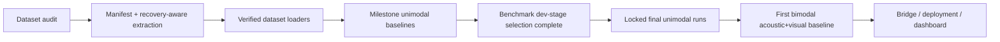

# MindSense

> Multimodal depression-risk estimation research project using facial and acoustic signals from E-DAIC and D-Vlog.

This repo is the public research log for the project as it actually exists today. It includes the verified data-foundation layer, unimodal training code, benchmark configs, curated result artifacts, and a session-by-session progress log. It does not yet include the planned multimodal fusion model, bridge model, live dashboard, or deployment stack.

## At A Glance

| Area | Exact status |
|---|---|
| Dataset audit | Complete and verified for D-Vlog and E-DAIC |
| Manifest + extraction tracking | Complete, including explicit partial-recovery handling |
| D-Vlog loader | Complete and verified |
| E-DAIC loader | Complete and verified |
| Milestone unimodal baselines | Complete |
| Benchmark-quality unimodal search | Dev-stage complete for all 4 tracks |
| Locked final benchmark runs | Not started yet |
| Bimodal acoustic+visual model | Not started yet |
| Live inference / dashboard | Not started yet |

## What Is Public In This Repo

- Source code for dataset auditing, manifest generation, unimodal loaders, encoders, aggregation, training, and evaluation.
- Benchmark configs under `configs/`.
- Curated experiment artifacts under `results/baselines/` and `results/benchmark_quality/unimodal_benchmark_v1/`.
- The running research log in `team_progress`.

Intentionally not published:
- Raw datasets, extracted heavy arrays, downloaded videos, `_reference_repo/`, installers, and other bulky or scratch-only files.

## Foundation Snapshot

The current data layer is not a mockup. It was verified end to end before model work was expanded.

| Checkpoint | Recorded result |
|---|---|
| Manifest coverage | `1236` total entries |
| E-DAIC manifest entries | `275` |
| E-DAIC extraction state | `274` complete, `1` partial (`383_P`, acoustic-only) |
| D-Vlog loader verification | train `647` subjects / `25738` windows, valid `102` / `3746`, test `212` / `8139` |
| E-DAIC loader verification | visual train `162` subjects / `10369` windows, acoustic train `163` / `10499` windows |

## Milestone Baseline Snapshot

These were the first verified end-to-end unimodal baselines. They are milestone results, not the final benchmark-quality locked runs.

| Dataset | Modality | Selected aggregation | Dev macro F1 | Test macro F1 |
|---|---|---|---:|---:|
| D-Vlog | Acoustic | `topk` | `0.6161 +/- 0.0299` | `0.6445 +/- 0.0367` |
| D-Vlog | Visual | `topk` | `0.5816 +/- 0.0488` | `0.5323 +/- 0.0389` |
| E-DAIC | Acoustic | `mean` | `0.4597 +/- 0.0267` | `0.5523 +/- 0.0519` |
| E-DAIC | Visual | `mean` | `0.4819 +/- 0.0167` | `0.5395 +/- 0.0202` |

## Benchmark Dev-Stage Snapshot

The stronger research pack is the dev-stage benchmark suite under `results/benchmark_quality/unimodal_benchmark_v1/`. This stage is complete for all four unimodal tracks, which means the best dev-set settings have already been selected and frozen for the next locked final runs.

| Track | Selected window | Selected training policy | Selected capacity | Frozen aggregation | Best dev macro F1 |
|---|---|---|---|---|---:|
| `dvlog_acoustic` | `9s` | `bce_balanced` | `hidden128_layers1` | `mean` | `0.6935` |
| `dvlog_visual` | `9s` | `bce_balanced` | `hidden64_layers1` | `mean` | `0.6101` |
| `edaic_acoustic` | `9s` | `focal_balanced` | `hidden128_layers2` | `mean` | `0.6059` |
| `edaic_visual` | `30s` | `bce_balanced` | `hidden128_layers2` | `mean` | `0.5325` |

Key readouts:
- D-Vlog favored shorter `9s` windows on both unimodal tracks.
- E-DAIC acoustic preferred `focal_balanced`, unlike D-Vlog.
- E-DAIC visual improved only after moving to a larger `30s` window and a deeper model.
- The repository is now at the exact point where locked final runs should be launched, not at the point of guessing hyperparameters.

## Public Repro Notes

- Large processed artifacts stay outside Git by design.
- External storage paths are now environment-configurable through:
  - `MINDSENSE_EXTERNAL_DATA_ROOT`
  - `MINDSENSE_PROCESSED_ROOT`
  - `MINDSENSE_DVLOG_VIDEOS_DIR`
- Result paths written by the benchmark suite are repo-relative so public artifacts stay portable.

## Clinical And Privacy Note

This project is a behavioral screening support system for research use. It is not a clinical diagnostic instrument.

By default, the public repo avoids raw webcam, microphone, archive, and video dumps. The published snapshot focuses on code, configs, summaries, and curated evaluation artifacts rather than sensitive or heavyweight source media.

## Live Progress Of Project

This section is the repo's public heartbeat. It is meant to show what has been finished, why those steps mattered, what evidence we have recorded, and what comes next.

### Progress Dashboard

| Workstream | Status | Evidence already recorded | Why this step existed |
|---|---|---|---|
| Data audit | Complete | Dataset statistics, label distributions, corruption checks, normalization-file checks | We needed to prove the datasets were structurally usable before trusting any training result |
| Manifest generation | Complete | `1236` subject-level records with explicit source, labels, paths, and quality flags | This creates one clean interface for training code instead of hand-written split logic scattered across scripts |
| E-DAIC extraction recovery | Complete for milestone use | `274` complete subjects and `1` partial subject | Recovery logic mattered because silent corruption would have produced misleading availability counts and unreliable loader behavior |
| D-Vlog loader | Complete | Verified subject counts and window counts across train/valid/test | This step converts raw feature files into repeatable model-ready windows |
| E-DAIC loader | Complete | Verified 1 Hz resampling, quality filtering, and modality-aware window creation | E-DAIC is messy enough that loader correctness directly affects every downstream metric |
| Initial unimodal baselines | Complete | Four modality-specific milestone runs with dev/test metrics and artifact bundles | These gave us a real lower bound and validated the training/evaluation stack end to end |
| Benchmark dev-stage search | Complete | Full `selection_ledger.json`, `leaderboard.csv`, and per-stage summaries for all four tracks | This is the step that replaced intuition with measured config selection |
| Locked final unimodal runs | Pending | Not run yet | This is required to turn selected dev settings into the benchmark numbers we should cite publicly |
| Bimodal modeling | Pending | No released artifacts yet | We should only start fusion after the unimodal ceiling is properly locked |

### Recorded Data We Can Stand Behind

| Category | Recorded value | Interpretation |
|---|---|---|
| E-DAIC recovery | `274` success + `1` partial | The data layer is usable, but still honest about the one remaining damaged archive |
| Manifest size | `1236` entries | Both datasets are now represented in one consistent subject-level format |
| D-Vlog acoustic benchmark winner | `9s`, `bce_balanced`, `hidden128_layers1`, dev macro F1 `0.6935` | Acoustic is currently the strongest public D-Vlog branch |
| D-Vlog visual benchmark winner | `9s`, `bce_balanced`, `hidden64_layers1`, dev macro F1 `0.6101` | Visual works, but trails acoustic on D-Vlog |
| E-DAIC acoustic benchmark winner | `9s`, `focal_balanced`, `hidden128_layers2`, dev macro F1 `0.6059` | E-DAIC acoustic needed a stronger capacity/loss recipe than D-Vlog |
| E-DAIC visual benchmark winner | `30s`, `bce_balanced`, `hidden128_layers2`, dev macro F1 `0.5325` | E-DAIC visual appears to benefit from longer temporal context |

### Why The Sequence Of Steps Matters

| Step | Why we did it before the next one | What it unlocked |
|---|---|---|
| Audit before training | Training on unknown corruption would make every score suspect | Trustworthy dataset assumptions |
| Manifest before loaders | We needed one shared subject-level contract across datasets | Cleaner training and benchmarking code |
| Recovery-aware extraction before E-DAIC modeling | Partial failure had to be explicit, not silently dropped | Honest availability counts and safer modality handling |
| Milestone baselines before benchmark search | We first needed to verify the stack could train, evaluate, save, and aggregate correctly | A working end-to-end baseline pipeline |
| Benchmark dev-stage before final runs | Hyperparameters should be chosen by evidence, not by narrative | Frozen configs worth locking and testing |
| Locked unimodal runs before bimodal fusion | Fusion should beat strong unimodal references, not weak placeholders | A real bar for multimodal progress |

### Exact Status Right Now

- The repo is past the "foundation" phase.
- The repo is also past the "first toy baseline" phase.
- The current blocking step is the locked final unimodal benchmark run, not more dev-stage searching.
- Public claims should currently be framed as: verified data foundation complete, unimodal dev-stage benchmark selection complete, locked final runs pending, multimodal modeling pending.

### What We’re Going To Do Further

1. Run the locked final unimodal stage using the frozen configs from `selection_ledger.json`.
2. Review the resulting test metrics and promote them to the repo's benchmark source of truth.
3. Use those locked unimodal numbers as the bar for the first acoustic+visual bimodal baseline.
4. Start multimodal work only after the unimodal ceiling is recorded cleanly.

For a narrative log of the work as it happened, see `team_progress`.
