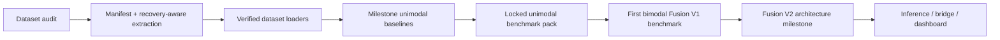

# MindSense

> Multimodal depression-risk estimation research project using facial and acoustic signals from E-DAIC and D-Vlog.

This repo is the public research log for the project as it actually exists today. It includes the verified data-foundation layer, finalized unimodal benchmark results, implemented bimodal `Fusion V1` code and curated benchmark artifacts, plus the running progress log in `team_progress`.

## At A Glance

| Area | Exact status |
|---|---|
| Dataset audit | Complete and verified for D-Vlog and E-DAIC |
| Manifest + extraction tracking | Complete, including explicit partial-recovery handling |
| D-Vlog loader | Complete and verified |
| E-DAIC loader | Complete and verified |
| Milestone unimodal baselines | Complete |
| Benchmark-quality unimodal search | Complete |
| Locked final unimodal benchmark runs | Complete |
| Bimodal acoustic+visual `Fusion V1` | Implemented and dev-stage benchmark complete |
| Bimodal smoke verification | Complete |
| Next architecture milestone | `Fusion V2` implementation |
| Live inference / dashboard | Not started yet |

## What Is Public In This Repo

- Source code for dataset auditing, manifest generation, unimodal and bimodal loaders, encoders, aggregation, training, and evaluation.
- Benchmark configs under `configs/`.
- Curated experiment artifacts under:
  - `results/baselines/`
  - `results/benchmark_quality/unimodal_benchmark_v1/`
  - `results/benchmark_quality/bimodal_benchmark_smoke/`
  - `results/benchmark_quality/bimodal_benchmark_v1/`
- The running research log in `team_progress`.

Intentionally not published:
- Raw datasets, extracted heavy arrays, downloaded videos, `_reference_repo/`, installers, live logs, and other bulky or scratch-only files.

## Foundation Snapshot

The current data layer is not a mockup. It was verified end to end before model work was expanded.

| Checkpoint | Recorded result |
|---|---|
| Manifest coverage | `1236` total entries |
| E-DAIC manifest entries | `275` |
| E-DAIC extraction state | `274` complete, `1` partial (`383_P`, acoustic-only) |
| D-Vlog loader verification | train `647` subjects / `25738` windows, valid `102` / `3746`, test `212` / `8139` |
| E-DAIC loader verification | visual train `162` subjects / `10369` windows, acoustic train `163` / `10499` windows |

## Final Unimodal Benchmark Snapshot

These are the locked 5-seed benchmark results from `results/benchmark_quality/unimodal_benchmark_v1/final/benchmark_summary.csv`. This is the current unimodal source of truth for the repo.

| Track | Window | Loss | Capacity | Dev macro F1 | Test macro F1 |
|---|---|---|---|---:|---:|
| `dvlog_acoustic` | `9s` | `bce_balanced` | `hidden128_layers1` | `0.6680 +/- 0.0415` | `0.6630 +/- 0.0100` |
| `dvlog_visual` | `9s` | `bce_balanced` | `hidden64_layers1` | `0.6028 +/- 0.0189` | `0.5943 +/- 0.0412` |
| `edaic_acoustic` | `9s` | `focal_balanced` | `hidden128_layers2` | `0.5922 +/- 0.0202` | `0.5134 +/- 0.0257` |
| `edaic_visual` | `30s` | `bce_balanced` | `hidden128_layers2` | `0.5220 +/- 0.0292` | `0.5355 +/- 0.0686` |

Key readouts:
- D-Vlog acoustic is the strongest finalized unimodal branch so far.
- E-DAIC acoustic was the strongest unimodal branch on dev, but E-DAIC visual slightly edged it on final test with higher variance.
- Final locked runs are complete, so the repo has moved beyond dev-stage-only reporting.

## Bimodal Fusion V1 Snapshot

The first multimodal architecture is implemented as `Fusion V1` and its full dev-stage benchmark suite completed on **April 4, 2026 at 19:37 IST**. These are dev-stage selection results only, not finalized test-set benchmark claims.

| Track | Selected window | Selected policy | Selected capacity | Frozen aggregation | Best dev macro F1 |
|---|---|---|---|---|---:|
| `edaic_bimodal` | `15s` | `focal_balanced` | `hidden128_layers2` | `attention` | `0.5352` |
| `dvlog_bimodal` | `9s` | `bce_balanced` | `hidden128_layers1` | `mean` | `0.7024` |

Evidence-backed interpretation:
- `Fusion V1` is a valid multimodal baseline.
- On `D-Vlog`, `Fusion V1` already beats both finalized unimodal dev baselines.
- On `E-DAIC`, `Fusion V1` does not yet beat the stronger acoustic unimodal baseline.
- That split result is exactly why the next milestone is **`Fusion V2`**, not immediate promotion of `Fusion V1` as the final architecture.

## Public Repro Notes

- Large processed artifacts stay outside Git by design.
- External storage paths are environment-configurable through:
  - `MINDSENSE_EXTERNAL_DATA_ROOT`
  - `MINDSENSE_PROCESSED_ROOT`
  - `MINDSENSE_DVLOG_VIDEOS_DIR`
- Result paths written by the benchmark suite are repo-relative so curated public artifacts stay portable.

## Clinical And Privacy Note

This project is a behavioral screening support system for research use. It is not a clinical diagnostic instrument.

By default, the public repo avoids raw webcam, microphone, archive, and video dumps. The published snapshot focuses on code, configs, summaries, and curated evaluation artifacts rather than sensitive or heavyweight source media.

## Live Progress Of Project

This section is the repo's public heartbeat. It shows what has been finished, why those steps mattered, what evidence we have recorded, and what comes next.

### Current State

| Workstream | Status | Verified artifact(s) | Why this step existed |
|---|---|---|---|
| Data audit | Complete | `data/audit_report.json` | We needed to prove the datasets were structurally usable before trusting any training result |
| Manifest generation | Complete | `manifest.jsonl` generation + extraction-state tracking | This creates one clean interface for training code instead of hand-written split logic scattered across scripts |
| E-DAIC extraction recovery | Complete for milestone use | `274` complete subjects and `1` partial subject | Recovery logic mattered because silent corruption would have produced misleading availability counts and unreliable loader behavior |
| D-Vlog loader | Complete | Verified subject and window counts across train/valid/test | This step converts raw feature files into repeatable model-ready windows |
| E-DAIC loader | Complete | Verified 1 Hz resampling, quality filtering, and modality-aware window creation | E-DAIC is messy enough that loader correctness directly affects every downstream metric |
| Locked unimodal benchmark | Complete | Final milestone report + benchmark summary CSV | This gives us the benchmark numbers we can cite publicly today |
| Bimodal `Fusion V1` implementation | Complete | Bimodal model code, runner support, configs, smoke outputs | This proves the repo now supports real multimodal training rather than only unimodal benchmarking |
| Bimodal `Fusion V1` dev benchmark | Complete | `results/benchmark_quality/bimodal_benchmark_v1/selection_ledger.json` | This gave us evidence for where simple fusion works and where it still falls short |
| Next architecture milestone | Ready to start | `Fusion V2` plan captured in `implementation_plan.md` | We need a stronger multimodal architecture, not just more repetitions of the same fusion recipe |

### Recorded Results We Can Stand Behind

| Category | Recorded value | Interpretation |
|---|---|---|
| E-DAIC recovery | `274` success + `1` partial | The data layer is usable, but still honest about the one remaining damaged archive |
| Manifest size | `1236` entries | Both datasets are now represented in one consistent subject-level format |
| Final D-Vlog acoustic benchmark | test macro F1 `0.6630 +/- 0.0100` | Current strongest finalized unimodal result in the repo |
| Final E-DAIC acoustic benchmark | dev macro F1 `0.5922 +/- 0.0202` | Strongest unimodal E-DAIC dev reference that multimodal models must beat |
| Final E-DAIC visual benchmark | test macro F1 `0.5355 +/- 0.0686` | Shows longer-context visual modeling can stay competitive on final test |
| `Fusion V1` D-Vlog bimodal | dev macro F1 `0.7024` | First clear sign that fusion is already helping on D-Vlog |
| `Fusion V1` E-DAIC bimodal | dev macro F1 `0.5352` | First fusion baseline works, but is not yet strong enough to beat the best E-DAIC unimodal reference |

### Why These Steps Matter

| Step | Why we did it before the next one | What it unlocked |
|---|---|---|
| Audit before training | Training on unknown corruption would make every score suspect | Trustworthy dataset assumptions |
| Manifest before loaders | We needed one shared subject-level contract across datasets | Cleaner training and benchmarking code |
| Recovery-aware extraction before E-DAIC modeling | Partial failure had to be explicit, not silently dropped | Honest availability counts and safer modality handling |
| Milestone baselines before benchmark search | We first needed to verify the stack could train, evaluate, save, and aggregate correctly | A working end-to-end baseline pipeline |
| Locked unimodal runs before multimodal promotion | Fusion should beat strong unimodal references, not weak placeholders | A real bar for multimodal progress |
| `Fusion V1` before `Fusion V2` | We needed a first multimodal baseline to reveal where simple fusion helps and where it fails | Evidence-driven architecture upgrades instead of guesswork |

### Exact Status Right Now

- The repo is past the foundation phase.
- The repo is past the toy-baseline phase.
- The repo already contains a finalized unimodal benchmark pack.
- The repo already contains an implemented bimodal baseline with a completed dev-stage benchmark.
- The current architectural decision is evidence-backed:
  - freeze `Fusion V1` as the multimodal baseline
  - build `Fusion V2` as the main upgrade path

### What We're Doing Next

1. Keep `Fusion V1` as the benchmark baseline rather than prematurely promoting it as the final multimodal model.
2. Implement `Fusion V2` with stronger modality encoders, reliability-aware latent fusion, teacher distillation, masked multitask supervision, and learned subject-level aggregation.
3. Benchmark `Fusion V2` directly against the strongest unimodal model and `Fusion V1` on both datasets.
4. Promote winners by evidence, not by narrative.

For a narrative log of the work as it happened, see `team_progress`.
