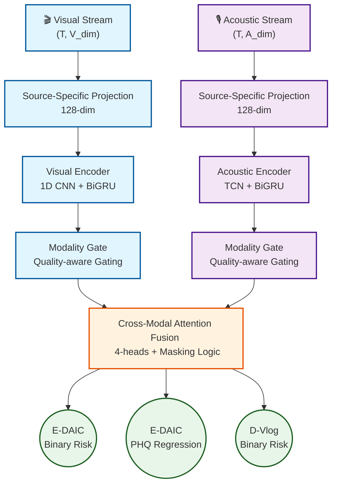
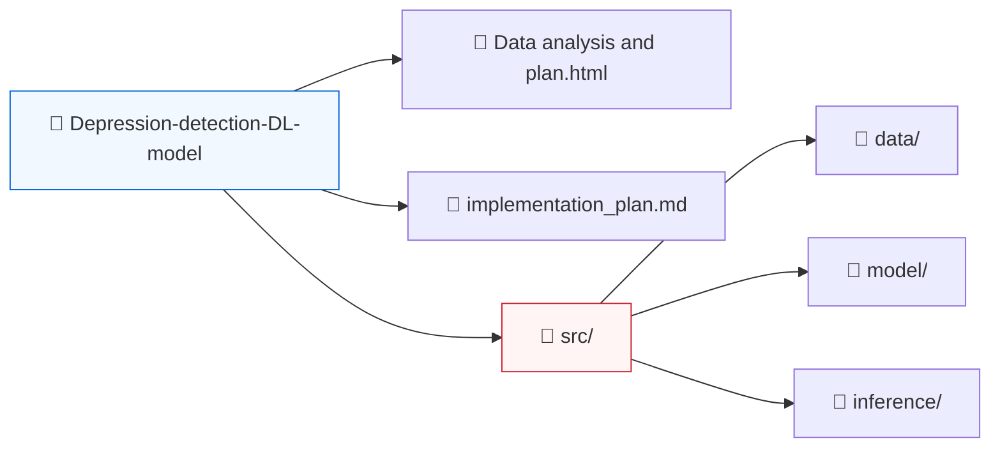

# 🧠 MindSense
### **Multimodal Depression Detection AI**

 

*An advanced multi-task, quality-aware deep learning architecture designed for real-time behavioral screening and depression risk estimation using high-dimensional facial and acoustic modalities.*

 

**[ System Architecture ](#-system-architecture) • [ Key Features ](#-key-features) • [ Implementation Roadmap ](#-implementation--roadmap) • [ Ethics & Privacy ](#%E2%9A%96%EF%B8%8F-ethics--privacy)**

---

## 📖 Overview

MindSense is an ongoing implementation of a multimodal deep learning system designed to estimate depression risk via non-invasive behavioral signals. By leveraging high-dimensional facial expressions (landmarks, pose, gaze) and acoustic features, this predictive pipeline delivers real-time inference suitable for clinical screening augmentation.

### 📊 Integrated Datasets
*   **E-DAIC:** Highly controlled clinical interviews *(PHQ-8 Continuous + Binary labels)*.
*   **D-Vlog:** "In-the-wild" YouTube vlogs highlighting continuous speech and behavior *(Binary labels)*.

> [!WARNING]  
> **Clinical Disclaimer:** This tool acts strictly as a **behavioral screening support system** and is not a clinical diagnostic instrument.

 

## 🏗 System Architecture

The core of the system relies on a **Source-Aware Multimodal Transformer** that applies quality-aware modality gating before fusing features through cross-modal attention.

 

## 🚀 Key Features

### 🧩 Robust Multimodal Architecture
*   **Missing Modality Masking:** Seamlessly ingests unimodal inputs when either facial tracking or audio streams drop below minimum confidence thresholds in real-time.
*   **Quality-Aware Gating:** Automatically down-weights unreliable streams via dynamically computed confidence scores (e.g., MediaPipe tracker uncertainty, poor VAD confidence).

### 🎯 Advanced Multi-Task Learning Strategy
*   **Joint Optimization:** Co-trains both datasets using a unique Multi-Task Loss methodology targeting regression and binary thresholds simultaneously: 
    *   `L = α(L_binary_edaic) + β(L_phq_regression) + γ(L_binary_dvlog)`
*   **Focal Loss Tuning:** Custom focal loss down-weights overwhelmingly clear samples, natively adapting to inherent dataset class imbalances.

### ⚡ Sub-Second Real-Time Inference
*   **Live Overlays:** Smooth, 60 FPS feature tracking overlays mapped to user webcam feeds.
*   **Async Execution:** Heavy inference operations are fully decoupled from tracking loops to prevent UI blocking.
*   **Bridge Learning:** Employs feature-bridge models allowing weights trained on heavy offline extractors (OpenFace/eGeMAPS) to accept lightweight, localized tracker outputs in production (MediaPipe/Librosa).

 

## 🛠️ Implementation & Roadmap

<b>Phase 1 & 2: Dataset Verification & Ingestion</b>

 

- ✅ Unify E-DAIC and D-Vlog data representations.
- ✅ Implement quality constraints on OpenFace parameters.
- ✅ Build dynamic manifest generators with strict sequence validation logic.

<b>Phase 3 & 4: Training & Modelling</b>

 

- ✅ Verify baseline ladder metrics (Acoustic vs. Visual unimodality performance bounds).
- ✅ Construct source-conditioned LayerNorm fusion architectures to bridge dataset domains.
- ✅ Formulate temporal subject-level prediction aggregators.

<b>Phase 5 & 6: Deployment & Feature Matching</b>

 

- ✅ Develop MediaPipe-to-OpenFace Feature Bridge projection prototypes.
- ⏳ Establish Flask / FastAPI async socket communication pipelines.
- ⏳ Integrate Text modality transcript parsing + Rule-based NLP sentiment gating.
- ⏳ Launch dashboard enhancements for real-time visualization.

 

## 📂 Repository Access

> [!NOTE]  
> The underlying heavy binaries (`.mp4`, `.npy`, and `.mat` datasets) are intentionally `.gitignored` to comply with data privacy policies and LFS storage constraints. Only core logic, models, architectures, and implementation plans are exposed.

 

## ⚖️ Ethics & Privacy 

**Bias Mitigation Strategy:**
This model completely avoids text transcription features (unless heavily scrubbed) to bypass severe "Interviewer Prompts Bias" inherent to clinical datasets. Demographic bias tracking isolates variance across *(Male vs. Female)* and *(Age brackets)* ensuring balanced screening integrity. 

**Data Locality:**
Tracking captures are localized telemetry bounds. The system runs entirely inference-edge using memory buffers; absolutely zero raw video or audio frames are recorded, stored, or forwarded over network limits.
