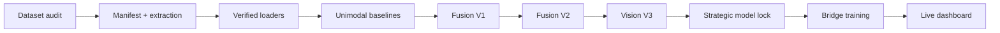
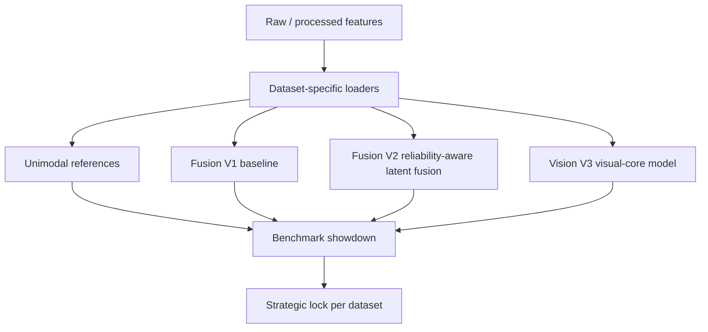
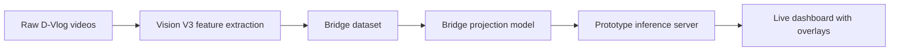

# MindSense

> Vision-first multimodal depression-risk estimation from facial behavior, body cues, gaze patterns, and auxiliary audio across E-DAIC and D-Vlog.


## The Idea

MindSense is a research system for **depression-risk estimation from behavior**, not a clinical diagnostic tool.

The project started with a simple question:

Can we build a technically honest, benchmark-backed system that reads depression-relevant signals from:

- facial motion and expression
- gaze and blink behavior
- body and hand movement
- acoustic patterns as support

And can we do it in a way that works across **controlled interviews** and **in-the-wild videos**, while staying explicit about failure modes, dataset shift, and deployment limits?

That question shaped the entire project:

- start with audited, reproducible data foundations
- build strong unimodal references first
- earn multimodal complexity only when it beats a real bar
- prefer **vision or fusion** over acoustic-only when performance is close enough
- build a bridge to live inference instead of pretending offline training features and webcam-time features are interchangeable

---

## Planned Approach In Short

The project plan has always been evidence-first:

1. Audit both datasets and make the data pipeline trustworthy.
2. Build unimodal baselines strong enough to act as real references.
3. Build `Fusion V1` as the first multimodal benchmark baseline.
4. Push to `Fusion V2` only if `V1` exposes real ceiling limits.
5. Pivot to a true **vision-first** architecture when the evidence says richer visual representation matters more than more acoustic tuning.
6. Lock the best model **per dataset**, not by narrative, but by benchmark evidence.
7. Build the bridge and live inference layer only after the offline winner is actually known.

That logic is what produced the current state:

- `D-Vlog` winner: `dvlog_vision_v3`
- `E-DAIC` winner: `edaic_bimodal` (`Fusion V1`)

---

## Why This Problem Is Hard

The project is hard for reasons that are technical, statistical, and dataset-specific:

- `E-DAIC` has real domain shift between train/dev and test.
- `D-Vlog` is larger, but much noisier and more varied.
- Depression labels are sparse and behaviorally indirect.
- Offline feature spaces and live webcam-time feature spaces are different problems.
- Strong acoustic baselines are easy to fall back to, but the project direction is deliberately **vision-first**.

That means the repo is not just chasing a single model score. It is trying to build a system that is:

- benchmark-credible
- architecture-aware
- deployment-aware
- honest about what has and has not been validated

---

## Technology Stack

### Core Stack


### Why These Choices

| Technology | Why we use it |
|---|---|
| `Python` | Fast research iteration, easy data tooling, and strong ML ecosystem fit |
| `PyTorch` | Flexible enough for rapid architecture pivots from unimodal baselines to latent fusion to vision-first models |
| `CUDA` on RTX 5060 | Practical training on local hardware without forcing cloud dependency into the milestone path |
| `NumPy` + `Pandas` | Stable array processing, benchmark ledgers, summaries, calibration outputs, and metric slicing |
| `OpenCV` | Efficient local video decoding and live-compatible frame processing without overcomplicating the first inference layer |
| `Torchvision` | Lightweight pretrained hook support for future stronger visual encoders |
| `Flask` | Simple, explicit prototype server for bridge status, model lock state, and live feature extraction endpoints |
| JSON / CSV result artifacts | Machine-readable experiment state, selection ledgers, milestone reports, and reproducible comparisons |

### Datasets

| Dataset | Role in project | Why it matters |
|---|---|---|
| `E-DAIC` | Clinical-style interview benchmark | Harder transfer problem, PHQ-linked labels, stricter generalization challenge |
| `D-Vlog` | In-the-wild behavioral benchmark | Best place to validate a vision-first real-world direction |

---

## Architecture We Planned

### Offline Research Stack


```mermaid
flowchart LR
    A[Dataset audit] --> B[Manifest + extraction]
    B --> C[Verified loaders]
    C --> D[Unimodal baselines]
    D --> E[Fusion V1]
    E --> F[Fusion V2]
    F --> G[Vision V3]
    G --> H[Strategic model lock]
    H --> I[Bridge training]
    I --> J[Live dashboard]
```

### Current Model Strategy


```mermaid
flowchart TD
    A[Raw / processed features] --> B[Dataset-specific loaders]
    B --> C[Unimodal references]
    B --> D[Fusion V1 baseline]
    B --> E[Fusion V2 reliability-aware latent fusion]
    B --> F[Vision V3 visual-core model]
    C --> G[Benchmark showdown]
    D --> G
    E --> G
    F --> G
    G --> H[Strategic lock per dataset]
```

### Deployment Strategy


```mermaid
flowchart LR
    A[Raw D-Vlog videos] --> B[Vision V3 feature extraction]
    B --> C[Bridge dataset]
    C --> D[Bridge projection model]
    D --> E[Prototype inference server]
    E --> F[Live dashboard with overlays]
```

### What This Means In Practice

- Offline research uses strong benchmark protocols and curated artifacts.
- Live inference is **not** allowed to skip the bridge.
- The bridge is the technical boundary between:
  - offline teacher feature spaces
  - live-compatible extracted feature spaces

That boundary is central to the honesty of the project.

---

## Project Story

This project did not go from idea to "final model" in one line. It grew in stages, and each stage changed what the next one had to solve.

### Phase 1: Data Foundation

The first phase was not modeling. It was trust-building:

- dataset audit
- manifest generation
- extraction recovery
- normalization handling
- split verification
- modality shape verification

What this gave us:

- `D-Vlog` and `E-DAIC` loaders we could actually believe
- explicit handling of damaged or partial samples
- a reproducible benchmark substrate instead of ad hoc scripts

### Phase 2: Unimodal References

Before building multimodal systems, we built strong unimodal references.

Locked 5-seed unimodal results:

| Track | Dev macro F1 | Test macro F1 |
|---|---:|---:|
| `dvlog_acoustic` | `0.6680 +/- 0.0415` | `0.6630 +/- 0.0100` |
| `dvlog_visual` | `0.6028 +/- 0.0189` | `0.5943 +/- 0.0412` |
| `edaic_acoustic` | `0.5922 +/- 0.0202` | `0.5134 +/- 0.0257` |
| `edaic_visual` | `0.5220 +/- 0.0292` | `0.5355 +/- 0.0686` |

What this told us:

- `D-Vlog` acoustic was the initial bar to beat.
- `E-DAIC` was unstable enough that unimodal visual and acoustic each mattered in different ways.
- Any multimodal claim had to beat real references, not weak placeholders.

---

## Fusion V1

`Fusion V1` was our first true multimodal architecture milestone.

### What We Did In V1

- built the repo's first benchmark-quality bimodal path
- integrated joint visual + acoustic training
- added subject-level aggregation and benchmark harness support
- froze the first real multimodal reference per dataset

### Best Verified `Fusion V1` Results

| Dataset | Dev highlight | Locked test macro F1 |
|---|---:|---:|
| `D-Vlog` | `0.7024` dev macro F1 | `0.6131 +/- 0.0111` |
| `E-DAIC` | `0.5352` dev macro F1 | `0.5563 +/- 0.0342` |

### Why V1 Mattered

`Fusion V1` proved that:

- the repo could train and evaluate real multimodal models
- D-Vlog could benefit from multimodal reasoning
- E-DAIC needed something stronger and more careful than simple bimodal fusion

### What Went Wrong In V1

`Fusion V1` was not enough as the final answer because:

- on `E-DAIC`, it still trailed the stronger acoustic dev bar
- on `D-Vlog`, it looked promising, but the locked test result was not enough to justify calling it the final architecture

That pushed the project toward `Fusion V2`.

---

## Fusion V2

`Fusion V2` was the ambitious multimodal upgrade.

### What We Added In V2

- heterogeneous modality bundles by dataset
- richer E-DAIC modality support
- reliability-aware latent fusion
- teacher-style auxiliary supervision
- stronger subject-level aggregation
- gate logging and quality-aware analysis

### What Went Right

`Fusion V2` was not a dead end. It moved the project forward in important ways:

- it improved over `Fusion V1` on `D-Vlog` test
- it cleared the planned E-DAIC dev bar
- it proved the richer benchmark harness and evidence-led showdown system

Corrected synced `Fusion V2` showdown:

| Dataset | Test macro F1 |
|---|---:|
| `D-Vlog Fusion V2` | `0.6279 +/- 0.0142` |
| `E-DAIC Fusion V2` | `0.4871 +/- 0.0658` |

### What Went Wrong In V2

`Fusion V2` still did not become the promoted architecture because:

- on `D-Vlog`, it still stayed below the strongest acoustic baseline
- on `E-DAIC`, it improved on dev but failed to transfer on final test
- the architecture got better, but not stable enough where it mattered

What V2 taught us:

- richer fusion alone was not the answer
- our visual side still needed stronger representation
- the project needed a clearer commitment to a **vision-first** direction

That is what led to `Vision V3`.

---

## Vision V3

`Vision V3` was the strategic pivot.

It was not "Fusion V2 but larger." It was a different idea:

- treat vision as the center of the system
- use richer raw-video-derived visual signals
- keep audio as auxiliary support
- make D-Vlog the proving ground for the vision-first direction

### What We Added In V3

- D-Vlog raw-video extraction pipeline
- richer visual bundles:
  - body pose
  - hand pose
  - gaze and blink
  - face-affect embedding path
- a new subject-level vision-first model family
- a dedicated Vision V3 smoke, dev benchmark, and showdown path

### What Happened In V3

This is where the project crossed an important threshold.

Vision V3 dev benchmark:

- selected `visual_full_aux_audio`
- selected `fixed_prior`
- selected `subject_mean`
- selected `dropout_on`
- reached `0.7087` dev macro F1

Vision V3 locked showdown:

| Track | Test macro F1 |
|---|---:|
| `dvlog_vision_v3` | `0.6666 +/- 0.0310` |
| `dvlog_acoustic` | `0.6630 +/- 0.0100` |

### Why V3 Was The Breakthrough

`Vision V3` did not win by a huge margin. It won in a more important way:

- it became the first **vision-first** D-Vlog architecture to beat the locked acoustic benchmark on final test
- it matched the project's strategic direction
- it turned "vision-first" from aspiration into a benchmark-backed result

That is why the repo now locks:

- `D-Vlog` -> `dvlog_vision_v3`
- `E-DAIC` -> `edaic_bimodal`

---

## Current Locked Winners

These are the current source-of-truth models for the repo.

| Dataset | Locked winner | Test macro F1 | Why it is locked |
|---|---|---:|---|
| `D-Vlog` | `dvlog_vision_v3` | `0.6666 +/- 0.0310` | Best verified D-Vlog model and aligned with the project's vision-first direction |
| `E-DAIC` | `edaic_bimodal` (`Fusion V1`) | `0.5563 +/- 0.0342` | Strongest verified E-DAIC result after V2 failed to hold on final test |

Strategic rule:

- if a vision or fusion model is the winner, we lock it
- if a vision or fusion model is within about `0.05` of acoustic, it stays the preferred direction
- acoustic-only is a reference, not the default identity of the system

---

## What We Chose And Why

The final choices were not made by style preference alone.

### D-Vlog

We chose `dvlog_vision_v3` because:

- it won the final showdown
- it validated the vision-first hypothesis
- it gave the project a real visual deployment direction

### E-DAIC

We chose `edaic_bimodal` (`Fusion V1`) because:

- it remained the strongest verified E-DAIC model
- `Fusion V2` looked better on dev but failed to hold on final test
- the honest answer was to keep the stronger verified model, not force a narrative upgrade

---

## Current Progress Snapshot

### Completed

- dataset audit and manifest system
- D-Vlog and E-DAIC verified loaders
- unimodal baselines
- locked unimodal benchmark suite
- `Fusion V1` implementation and locked benchmark
- `Fusion V2` implementation, benchmark, and corrected synced showdown
- `Vision V3` D-Vlog implementation
- D-Vlog raw-video extraction
- `Vision V3` D-Vlog benchmark and locked showdown
- strategic model lock
- bridge feature extraction
- prototype inference server
- bridge training stack implementation

### In Progress

- bridge model training
- live inference integration
- dashboard layer for prototype visualization

---

## Benchmark Artifacts Published

Key curated result roots in this repo:

- `results/benchmark_quality/fusion_v1_locked/`
- `results/benchmark_quality/fusion_v2_smoke/`
- `results/benchmark_quality/fusion_v2_benchmark/`
- `results/benchmark_quality/fusion_v2_showdown_synced/`
- `results/benchmark_quality/vision_v3_dvlog_smoke/`
- `results/benchmark_quality/vision_v3_dvlog_benchmark/`
- `results/benchmark_quality/vision_v3_dvlog_showdown/`

These include:

- summary JSONs
- config snapshots
- selection ledgers
- leaderboards
- milestone reports

Heavy local-only artifacts such as per-seed checkpoints are intentionally excluded from Git.

---

## Repository Layout

```text
src/
  data/
    dataset_audit.py
    edaic_extractor.py
    dvlog_video_extractor.py
    fusion_v2_datasets.py
    vision_v3_datasets.py
    bridge_extractor.py
    bridge_dataset.py
  model/
    encoders.py
    fusion_v2.py
    vision_v3.py
    bridge.py
  training/
    baselines.py
    benchmark_suite.py
    fusion_v2.py
    vision_v3.py
    bridge.py
  inference/
    model_lock.py
    feature_extractor.py
    server.py
    dashboard/
configs/
results/
team_progress
implementation_plan.md
```

---

## Responsible Use

This project is a research and prototype system for **behavioral risk estimation**.

It is **not**:

- a clinical diagnosis system
- a substitute for professional evaluation
- a validated real-time mental health screening product

The live layer remains intentionally conservative:

- bridge first
- live prediction later
- honesty always

---

## Immediate Next Step

The next milestone target is explicit:

By **Tuesday, April 7, 2026**, the goal is to move from the current prototype server to a **live dashboard with video and overlays**, backed by:

- bridge-model training
- bridge-to-live feature mapping
- visual overlays
- quality-aware display boundaries
- honest messaging around what the live system can and cannot claim

That is the next step the repo is now built to support.

---

## Why This Project Matters

The strongest part of this repo is not a single model score.

It is that the project now has:

- audited data foundations
- benchmark-backed references
- an evidence-led architecture story
- a real V1 -> V2 -> V3 progression
- a promoted vision-first winner on D-Vlog
- a disciplined lock decision on E-DAIC
- a concrete bridge path toward live inference

That means the work was not wasted at any phase:

- `V1` made multimodal benchmarking real
- `V2` exposed where richer fusion helps and where it still fails
- `V3` proved the vision-first direction can actually win

And now the project can move from model selection to system realization.
