<p align="center">
  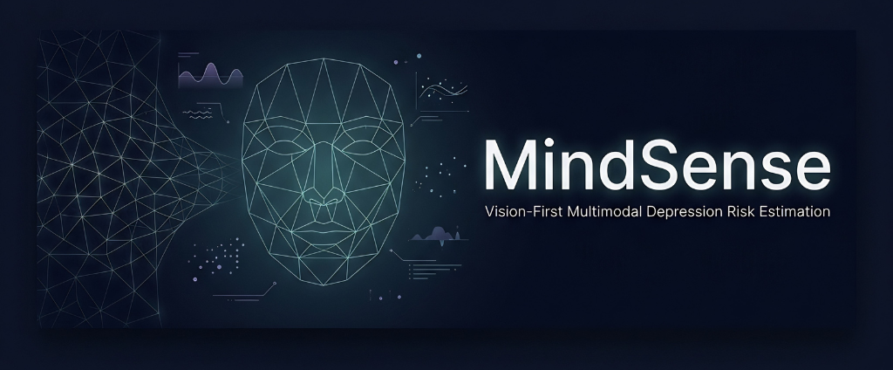
</p>

<h1 align="center">MindSense</h1>

<p align="center">
  <strong>Vision-first multimodal depression-risk estimation from facial behavior, body cues, gaze patterns, and auxiliary audio across E-DAIC and D-Vlog.</strong>
</p>

<p align="center">
  
  
  
</p>

<p align="center">
  
  
  
</p>

---

## 📑 Table of Contents

<details>
<summary><strong>Click to expand</strong></summary>

- [The Idea](#-the-idea)
- [Why This Problem Is Hard](#-why-this-problem-is-hard)
- [Technology Stack](#-technology-stack)
- [Dataset Access & Permission Proofs](#-dataset-access--permission-proofs)
- [System Architecture](#-system-architecture)
  - [End-to-End Pipeline](#end-to-end-pipeline)
  - [Model Strategy & Selection](#model-strategy--selection)
  - [Vision V3 Architecture](#vision-v3-architecture-d-vlog-winner)
  - [Deployment & Bridge Strategy](#deployment--bridge-strategy)
- [Project Evolution](#-project-evolution)
  - [Phase 1: Data Foundation](#phase-1-data-foundation)
  - [Phase 2: Unimodal References](#phase-2-unimodal-references)
  - [Fusion V1](#fusion-v1--first-multimodal-baseline)
  - [Fusion V2](#fusion-v2--ambitious-upgrade)
  - [Vision V3](#vision-v3--the-breakthrough)
- [Benchmark Results](#-benchmark-results)
  - [Locked Winners](#current-locked-winners)
  - [Performance Progression](#performance-progression-d-vlog-test-macro-f1)
- [Repository Layout](#-repository-layout)
- [Benchmark Artifacts](#-benchmark-artifacts)
- [Roadmap](#-roadmap)
- [Responsible Use](#-responsible-use)
- [License](#-license)

</details>

---

## 🧠 The Idea

MindSense is a research system for **depression-risk estimation from behavior** — not a clinical diagnostic tool.

The project started with a single question:

> *Can we build a technically honest, benchmark-backed system that reads depression-relevant signals from facial motion, gaze behavior, body movement, and acoustic patterns — and can we make it work across **controlled interviews** and **in-the-wild videos**, while staying explicit about failure modes, dataset shift, and deployment limits?*

That question shaped every architectural decision:

| Principle | What it means |
|:---|:---|
| 🔍 **Audited foundations** | Start with verified, reproducible data pipelines before any modeling |
| 📊 **Unimodal references first** | No multimodal claims without strong single-modality baselines to beat |
| 🏆 **Earn complexity** | Each architecture level must prove value against real benchmarks |
| 👁️ **Vision-first strategy** | Prefer vision or fusion over acoustic-only when performance is comparable |
| 🌉 **Bridged deployment** | Never pretend offline training features and live webcam features are interchangeable |

> [!IMPORTANT]
> This project uses an **evidence-led architecture selection** process. Models are promoted based on benchmark showdowns, not narrative preference. The locked winners below are chosen because they won verified 5-seed test evaluations.

---

## 🎯 Why This Problem Is Hard

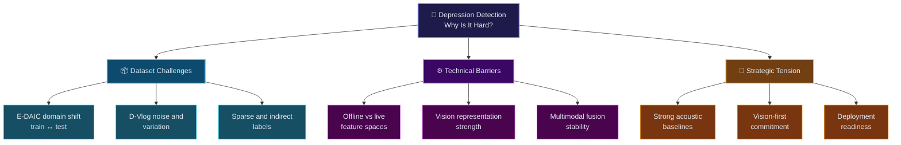
```mermaid
flowchart TD
    ROOT["🧠 Depression Detection\nWhy Is It Hard?"]

    ROOT --> DS["📦 Dataset Challenges"]
    ROOT --> TB["⚙️ Technical Barriers"]
    ROOT --> ST["🎯 Strategic Tension"]

    DS --> DS1["E-DAIC domain shift\ntrain ↔ test"]
    DS --> DS2["D-Vlog noise and\nvariation"]
    DS --> DS3["Sparse and indirect\nlabels"]

    TB --> TB1["Offline vs live\nfeature spaces"]
    TB --> TB2["Vision representation\nstrength"]
    TB --> TB3["Multimodal fusion\nstability"]

    ST --> ST1["Strong acoustic\nbaselines"]
    ST --> ST2["Vision-first\ncommitment"]
    ST --> ST3["Deployment\nreadiness"]

    style ROOT fill:#1e1b4b,stroke:#818cf8,stroke-width:2px,color:#e2e8f0
    style DS fill:#0c4a6e,stroke:#38bdf8,stroke-width:2px,color:#e2e8f0
    style TB fill:#3b0764,stroke:#c084fc,stroke-width:2px,color:#e2e8f0
    style ST fill:#713f12,stroke:#fbbf24,stroke-width:2px,color:#e2e8f0
    style DS1 fill:#164e63,stroke:#22d3ee,color:#e2e8f0
    style DS2 fill:#164e63,stroke:#22d3ee,color:#e2e8f0
    style DS3 fill:#164e63,stroke:#22d3ee,color:#e2e8f0
    style TB1 fill:#4a044e,stroke:#e879f9,color:#e2e8f0
    style TB2 fill:#4a044e,stroke:#e879f9,color:#e2e8f0
    style TB3 fill:#4a044e,stroke:#e879f9,color:#e2e8f0
    style ST1 fill:#78350f,stroke:#f59e0b,color:#e2e8f0
    style ST2 fill:#78350f,stroke:#f59e0b,color:#e2e8f0
    style ST3 fill:#78350f,stroke:#f59e0b,color:#e2e8f0
```

The problem is hard for reasons that are **technical**, **statistical**, and **dataset-specific**:

- **E-DAIC** has real domain shift — the test set uses AI-controlled interviews while training uses Wizard-of-Oz sessions
- **D-Vlog** is larger but much noisier, with uncontrolled in-the-wild video conditions
- Depression labels are **sparse and behaviorally indirect** — no clean signals to latch onto
- **Offline** feature spaces (OpenFace AUs, eGeMAPS) and **live** webcam features (MediaPipe) are fundamentally different problems
- Strong acoustic baselines are easy to fall back to, but the project direction is deliberately **vision-first**

> [!NOTE]
> The system is not chasing a single model score. It is building something that is benchmark-credible, architecture-aware, deployment-aware, and honest about what has and hasn't been validated.

---

## 🛠️ Technology Stack

<p align="center">
  
  
  
  
  
  
  
</p>

<details>
<summary><strong>Why these choices?</strong></summary>

| Technology | Rationale |
|:---|:---|
| **Python 3.12** | Fast research iteration, rich ML ecosystem, easy data tooling |
| **PyTorch 2.x** | Flexible enough for rapid architecture pivots — unimodal → latent fusion → vision-first |
| **CUDA on RTX 5060** | Practical local training without forcing cloud dependency into the milestone path |
| **NumPy + Pandas** | Stable array processing, benchmark ledgers, calibration outputs, and metric slicing |
| **OpenCV** | Efficient video decoding and live-compatible frame processing |
| **Torchvision** | Lightweight pretrained hook support for stronger visual encoders |
| **Flask + Waitress** | Lightweight local API with a production-ready serving path for MJPEG video streaming, diagnostics, and live runtime control |

</details>

### Datasets

| Dataset | Setting | Participants | Role | Why it matters |
|:---|:---|:---:|:---|:---|
| **E-DAIC** | Clinical interviews | 275 | Controlled benchmark | Harder transfer problem, PHQ-linked labels, strict generalization challenge |
| **D-Vlog** | YouTube vlogs (in-the-wild) | 961 | Real-world benchmark | Best place to validate a vision-first approach on uncontrolled data |
| **MODMA EEG** | Resting-state + ERP EEG | 53-55 per public EEG subset | Approved expansion track | Adds neurophysiological signals that can complement behavior-centric depression analysis |

> [!NOTE]
> MindSense's current locked benchmark story remains centered on **E-DAIC** and **D-Vlog**. **MODMA EEG** is being documented as an approved next-step dataset for future multimodal expansion, not as a completed benchmark track yet.

The official MODMA access page lists three currently available EEG subsets:

- `EEG_128channels_ERP_lanzhou_2015`: `24` Major Depressive Disorder subjects + `29` Healthy Controls
- `EEG_128channels_resting_lanzhou_2015`: `24` Major Depressive Disorder subjects + `29` Healthy Controls
- `EEG_3channels_resting_lanzhou_2015`: `26` Major Depressive Disorder subjects + `29` Healthy Controls

---

## 🔐 Dataset Access & Permission Proofs

Some of the datasets used or planned in MindSense are gated behind institutional approval, signed EULAs, or maintainer review. This section makes that access trail visible so the README is explicit about responsible dataset use rather than silently implying everything was openly downloadable.

### E-DAIC / DAIC-WOZ

E-DAIC is a permission-controlled clinical interview dataset. The project has an approved DAIC-WOZ download request and signed end-user license coverage for the research team.

<p align="center">
  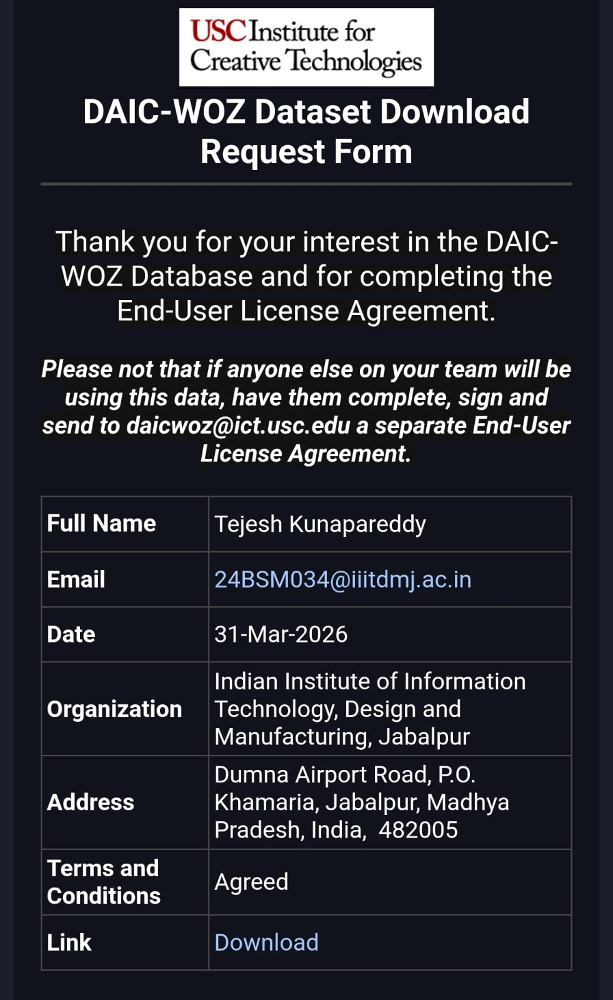
</p>
<p align="center">
  <em>Permission proof for DAIC-WOZ / E-DAIC access.</em>
</p>

### D-Vlog

D-Vlog access was granted by the dataset maintainers after the request form was submitted. The approval email also clarifies the dataset structure, extracted feature availability, and the research-use sharing path for the original video keys.

<p align="center">
  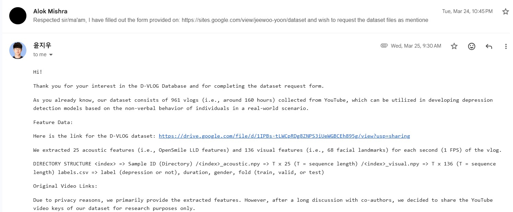
</p>
<p align="center">
  <em>Maintainer approval and research-use access details for the D-Vlog dataset.</em>
</p>

### MODMA EEG

[MODMA](https://modma.lzu.edu.cn/data/index/) is the **Multi-modal Open Dataset for Mental-disorder Analysis** maintained by Lanzhou University. According to the [official access page](https://modma.lzu.edu.cn/data/application/), the currently public portions include EEG and speech data from clinically diagnosed depressed participants and matched healthy controls, and access requires registration, signed EULA upload, and administrator approval.

For MindSense, MODMA matters because it can add a **neurophysiological signal path** alongside the current behavioral pipeline. E-DAIC and D-Vlog help us reason about visible and acoustic behavior; MODMA EEG offers a future way to test whether brain-signal features can enrich that picture and support deeper multimodal mental-health analysis without replacing the repo's current benchmarked foundations.

The approved MODMA screenshot below shows access granted for the three EEG subsets currently listed on the portal: `128-channel ERP`, `128-channel resting-state`, and `3-channel resting-state`.

<p align="center">
  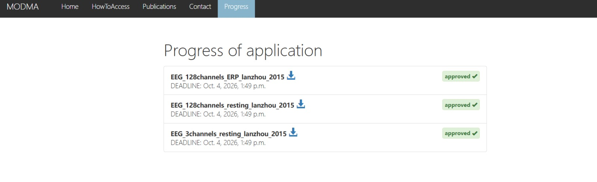
</p>
<p align="center">
  <em>Approval status for the requested MODMA EEG subsets on the official MODMA portal.</em>
</p>

---

## 🏗️ System Architecture

### End-to-End Pipeline

This diagram shows the complete research pipeline from raw data to live deployment:

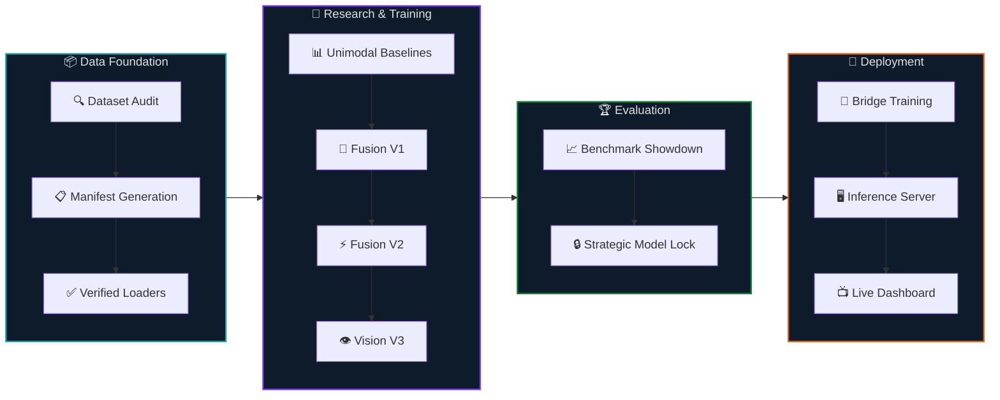
```mermaid
flowchart LR
    subgraph DATA["📦 Data Foundation"]
        direction TB
        A1["🔍 Dataset Audit"]
        A2["📋 Manifest Generation"]
        A3["✅ Verified Loaders"]
        A1 --> A2 --> A3
    end

    subgraph TRAIN["🧪 Research & Training"]
        direction TB
        B1["📊 Unimodal Baselines"]
        B2["🔗 Fusion V1"]
        B3["⚡ Fusion V2"]
        B4["👁️ Vision V3"]
        B1 --> B2 --> B3 --> B4
    end

    subgraph EVAL["🏆 Evaluation"]
        direction TB
        C1["📈 Benchmark Showdown"]
        C2["🔒 Strategic Model Lock"]
        C1 --> C2
    end

    subgraph DEPLOY["🚀 Deployment"]
        direction TB
        D1["🌉 Bridge Training"]
        D2["🖥️ Inference Server"]
        D3["📺 Live Dashboard"]
        D1 --> D2 --> D3
    end

    DATA --> TRAIN --> EVAL --> DEPLOY

    style DATA fill:#0d1b2a,stroke:#1b9aaa,stroke-width:2px,color:#e0e0e0
    style TRAIN fill:#0d1b2a,stroke:#7c3aed,stroke-width:2px,color:#e0e0e0
    style EVAL fill:#0d1b2a,stroke:#15803d,stroke-width:2px,color:#e0e0e0
    style DEPLOY fill:#0d1b2a,stroke:#ea580c,stroke-width:2px,color:#e0e0e0
```

### Model Strategy & Selection

The core architecture decision process — four competing model families evaluated against real benchmarks:

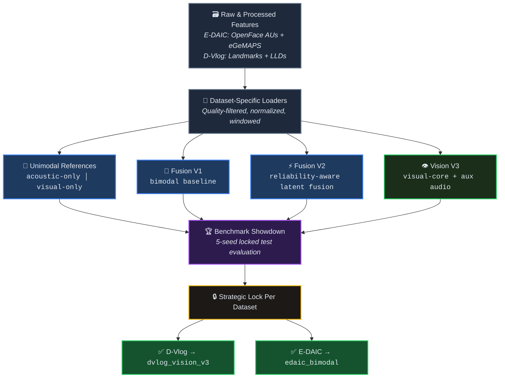
```mermaid
flowchart TD
    RAW["🗃️ Raw & Processed Features<br/><i>E-DAIC: OpenFace AUs + eGeMAPS</i><br/><i>D-Vlog: Landmarks + LLDs</i>"]

    RAW --> LOAD["📂 Dataset-Specific Loaders<br/><i>Quality-filtered, normalized, windowed</i>"]

    LOAD --> UNI["🎯 Unimodal References<br/><code>acoustic-only │ visual-only</code>"]
    LOAD --> FV1["🔗 Fusion V1<br/><code>bimodal baseline</code>"]
    LOAD --> FV2["⚡ Fusion V2<br/><code>reliability-aware latent fusion</code>"]
    LOAD --> VV3["👁️ Vision V3<br/><code>visual-core + aux audio</code>"]

    UNI --> SHOW["🏆 Benchmark Showdown<br/><i>5-seed locked test evaluation</i>"]
    FV1 --> SHOW
    FV2 --> SHOW
    VV3 --> SHOW

    SHOW --> LOCK["🔒 Strategic Lock Per Dataset"]

    LOCK --> DVLOG["✅ D-Vlog → <code>dvlog_vision_v3</code>"]
    LOCK --> EDAIC["✅ E-DAIC → <code>edaic_bimodal</code>"]

    style RAW fill:#1e293b,stroke:#64748b,stroke-width:2px,color:#e2e8f0
    style LOAD fill:#1e293b,stroke:#64748b,stroke-width:2px,color:#e2e8f0
    style UNI fill:#1e3a5f,stroke:#3b82f6,stroke-width:2px,color:#e2e8f0
    style FV1 fill:#1e3a5f,stroke:#3b82f6,stroke-width:2px,color:#e2e8f0
    style FV2 fill:#1e3a5f,stroke:#3b82f6,stroke-width:2px,color:#e2e8f0
    style VV3 fill:#1a2e1a,stroke:#22c55e,stroke-width:2px,color:#e2e8f0
    style SHOW fill:#2d1b4e,stroke:#a855f7,stroke-width:2px,color:#e2e8f0
    style LOCK fill:#1c1917,stroke:#eab308,stroke-width:2px,color:#e2e8f0
    style DVLOG fill:#14532d,stroke:#22c55e,stroke-width:2px,color:#e2e8f0
    style EDAIC fill:#14532d,stroke:#22c55e,stroke-width:2px,color:#e2e8f0
```

### Vision V3 Architecture (D-Vlog Winner)

The detailed internal architecture of the winning Vision V3 model:

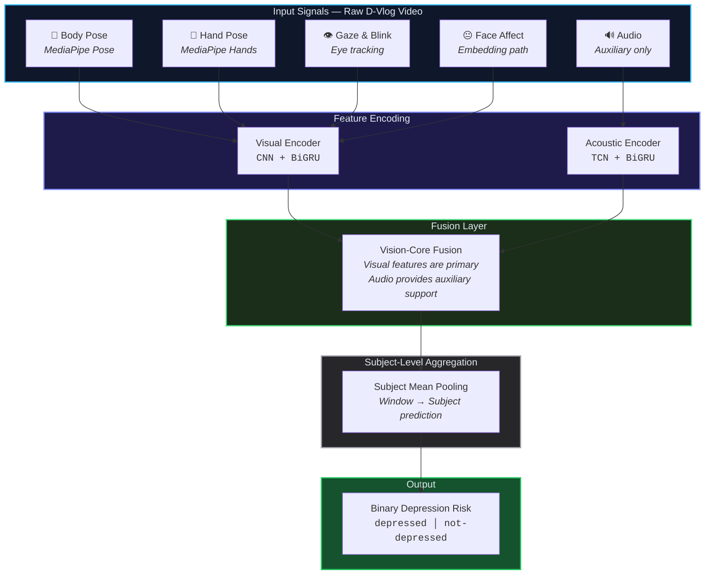
```mermaid
flowchart TD
    subgraph INPUT["Input Signals — Raw D-Vlog Video"]
        direction LR
        I1["🦴 Body Pose<br/><i>MediaPipe Pose</i>"]
        I2["🤲 Hand Pose<br/><i>MediaPipe Hands</i>"]
        I3["👁️ Gaze & Blink<br/><i>Eye tracking</i>"]
        I4["😐 Face Affect<br/><i>Embedding path</i>"]
        I5["🔊 Audio<br/><i>Auxiliary only</i>"]
    end

    subgraph ENCODE["Feature Encoding"]
        direction LR
        E1["Visual Encoder<br/><code>CNN + BiGRU</code>"]
        E2["Acoustic Encoder<br/><code>TCN + BiGRU</code>"]
    end

    subgraph FUSE["Fusion Layer"]
        F1["Vision-Core Fusion<br/><i>Visual features are primary</i><br/><i>Audio provides auxiliary support</i>"]
    end

    subgraph AGG["Subject-Level Aggregation"]
        G1["Subject Mean Pooling<br/><i>Window → Subject prediction</i>"]
    end

    subgraph OUT["Output"]
        H1["Binary Depression Risk<br/><code>depressed │ not-depressed</code>"]
    end

    I1 & I2 & I3 & I4 --> E1
    I5 --> E2
    E1 & E2 --> F1
    F1 --> G1
    G1 --> H1

    style INPUT fill:#0f172a,stroke:#38bdf8,stroke-width:2px,color:#e2e8f0
    style ENCODE fill:#1e1b4b,stroke:#818cf8,stroke-width:2px,color:#e2e8f0
    style FUSE fill:#1a2e1a,stroke:#4ade80,stroke-width:2px,color:#e2e8f0
    style AGG fill:#27272a,stroke:#a1a1aa,stroke-width:2px,color:#e2e8f0
    style OUT fill:#14532d,stroke:#22c55e,stroke-width:2px,color:#e2e8f0
```

### Deployment & Bridge Strategy

> [!WARNING]
> Live inference is **not allowed to skip the bridge**. The bridge is the technical boundary between offline teacher feature spaces and live-compatible extracted feature spaces. This boundary is central to the honesty of the project.

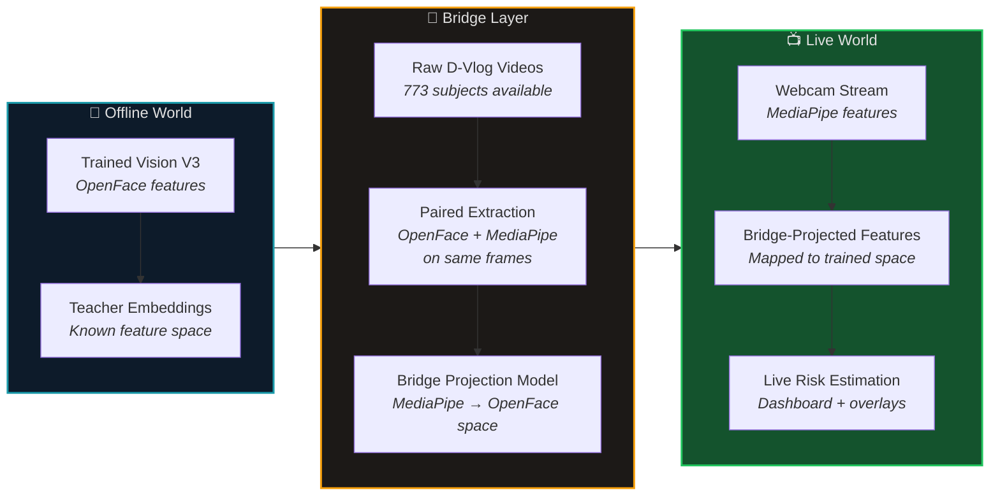
```mermaid
flowchart LR
    subgraph OFFLINE["🔬 Offline World"]
        direction TB
        O1["Trained Vision V3<br/><i>OpenFace features</i>"]
        O2["Teacher Embeddings<br/><i>Known feature space</i>"]
        O1 --> O2
    end

    subgraph BRIDGE["🌉 Bridge Layer"]
        direction TB
        B1["Raw D-Vlog Videos<br/><i>773 subjects available</i>"]
        B2["Paired Extraction<br/><i>OpenFace + MediaPipe<br/>on same frames</i>"]
        B3["Bridge Projection Model<br/><i>MediaPipe → OpenFace space</i>"]
        B1 --> B2 --> B3
    end

    subgraph LIVE["📺 Live World"]
        direction TB
        L1["Webcam Stream<br/><i>MediaPipe features</i>"]
        L2["Bridge-Projected Features<br/><i>Mapped to trained space</i>"]
        L3["Live Risk Estimation<br/><i>Dashboard + overlays</i>"]
        L1 --> L2 --> L3
    end

    OFFLINE --> BRIDGE --> LIVE

    style OFFLINE fill:#0d1b2a,stroke:#1b9aaa,stroke-width:2px,color:#e0e0e0
    style BRIDGE fill:#1c1917,stroke:#f59e0b,stroke-width:2px,color:#e0e0e0
    style LIVE fill:#14532d,stroke:#22c55e,stroke-width:2px,color:#e0e0e0
```

**What this means in practice:**

- Offline research uses strong benchmark protocols and curated artifacts
- The bridge trains a projection from **MediaPipe landmarks → OpenFace AU space** using 773 paired videos
- Only bridged features may be used for live inference — no shortcut mappings allowed
- The live dashboard now renders mirrored face mesh, pose overlays, and a secondary tracker-projection stage from the same live subject state
- The live server now owns the webcam loop end to end: threaded capture, backend analyzers, OpenCV overlays, MJPEG video feed, runtime diagnostics, and camera config/probing APIs

#### Live Dashboard Snapshot

<p align="center">
  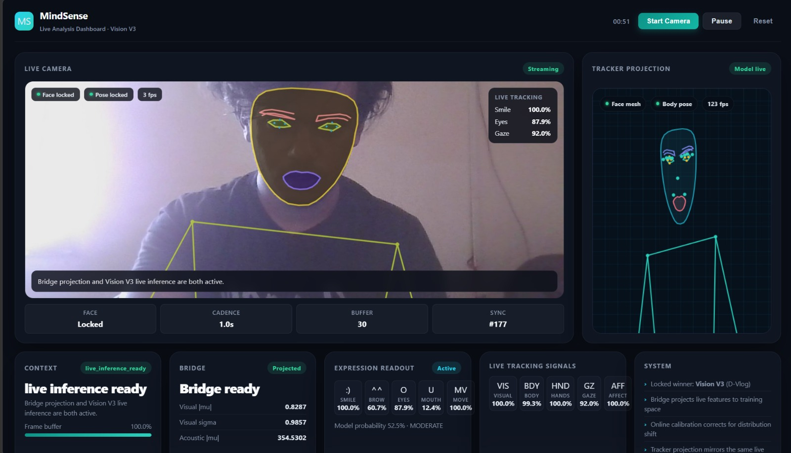
</p>
<p align="center">
  <em>Current live prototype: server-owned video feed, mirrored face mesh, pose skeleton overlays, tracker projection, and bridge-backed Vision V3 inference running together.</em>
</p>

---

## 📖 Project Evolution

The project grew in stages. Each stage changed what the next one had to solve.

### Phase 1: Data Foundation

The first phase was not modeling — it was **trust-building**:

- ✅ Full dataset audit across both E-DAIC and D-Vlog
- ✅ Manifest-first data system with extraction recovery
- ✅ Normalization handling and split verification
- ✅ Modality shape verification and quality flagging

**What this gave us:** Loaders we could actually believe, explicit handling of damaged/partial samples, and a reproducible benchmark substrate.

### Phase 2: Unimodal References

Before building multimodal systems, we built **strong unimodal references** to set a real bar.

> 5-seed locked unimodal results:

| Track | Dev macro F1 | Test macro F1 |
|:---|---:|---:|
| `dvlog_acoustic` | `0.6680 ± 0.0415` | `0.6630 ± 0.0100` |
| `dvlog_visual` | `0.6028 ± 0.0189` | `0.5943 ± 0.0412` |
| `edaic_acoustic` | `0.5922 ± 0.0202` | `0.5134 ± 0.0257` |
| `edaic_visual` | `0.5220 ± 0.0292` | `0.5355 ± 0.0686` |

> [!TIP]
> D-Vlog acoustic (`0.6630` test F1) became the bar to beat. Any multimodal claim had to surpass real references — not weak placeholders.

---

### Fusion V1 — First Multimodal Baseline

The repo's first benchmark-quality bimodal path: joint visual + acoustic training with subject-level aggregation.

| Dataset | Dev Highlight | Locked Test macro F1 |
|:---|---:|---:|
| `D-Vlog` | `0.7024` | `0.6131 ± 0.0111` |
| `E-DAIC` | `0.5352` | `0.5563 ± 0.0342` |

<details>
<summary><strong>What worked and what didn't</strong></summary>

**✅ What V1 proved:**
- The repo could train and evaluate real multimodal models
- D-Vlog could benefit from multimodal reasoning
- E-DAIC needed something stronger than simple bimodal fusion

**❌ What pushed us forward:**
- On E-DAIC, it still trailed the stronger acoustic dev bar
- On D-Vlog, the locked test result wasn't enough to justify calling it the final architecture

→ This pushed the project toward **Fusion V2**.

</details>

---

### Fusion V2 — Ambitious Upgrade

Fusion V2 added reliability-aware latent fusion, teacher-style auxiliary supervision, heterogeneous modality bundles, and stronger subject-level aggregation.

| Dataset | Test macro F1 |
|:---|---:|
| `D-Vlog Fusion V2` | `0.6279 ± 0.0142` |
| `E-DAIC Fusion V2` | `0.4871 ± 0.0658` |

<details>
<summary><strong>What worked and what didn't</strong></summary>

**✅ What V2 proved:**
- Improved over Fusion V1 on D-Vlog test
- Cleared the planned E-DAIC dev bar
- Proved the richer benchmark harness and evidence-led showdown system

**❌ What pushed us further:**
- On D-Vlog, still stayed below the strongest acoustic baseline
- On E-DAIC, improved on dev but **failed to transfer on final test**
- The architecture got better, but not stable enough where it mattered

**Key lesson:** Richer fusion alone was not the answer. The visual side needed **stronger representation** — leading to the Vision V3 pivot.

</details>

---

### Vision V3 — The Breakthrough

Vision V3 was not "Fusion V2 but larger." It was a **fundamentally different idea**: treat vision as the center of the system.

**What changed:**
- 🎬 D-Vlog raw-video extraction pipeline (body pose, hand pose, gaze & blink, face-affect embeddings)
- 👁️ New subject-level vision-first model family
- 🔊 Audio demoted to auxiliary support only
- 📊 Dedicated smoke → dev benchmark → showdown evaluation path

> **Dev benchmark:** `0.7087` macro F1 — highest dev score in project history

**Locked showdown (the moment of truth):**

| Track | Test macro F1 | |
|:---|---:|:---:|
| **`dvlog_vision_v3`** | **`0.6666 ± 0.0310`** | 🏆 |
| `dvlog_acoustic` | `0.6630 ± 0.0100` | — |

> [!IMPORTANT]
> **Why V3 was the breakthrough:** It didn't win by a huge margin. It won in a *more important way* — it became the first **vision-first** D-Vlog architecture to beat the locked acoustic benchmark on final test. It turned "vision-first" from aspiration into a **benchmark-backed result**.

---

## 📊 Benchmark Results

### Current Locked Winners

These are the **source-of-truth models** for the repo:

| Dataset | Locked Winner | Test macro F1 | Why It's Locked |
|:---|:---|:---:|:---|
| **D-Vlog** | `dvlog_vision_v3` | **`0.6666 ± 0.0310`** | Best verified D-Vlog model, aligned with vision-first direction |
| **E-DAIC** | `edaic_bimodal` (Fusion V1) | **`0.5563 ± 0.0342`** | Strongest verified E-DAIC result; V2 failed to hold on final test |

**Strategic locking rule:**
- If a vision or fusion model is the winner → lock it
- If a vision or fusion model is within `~0.05` of acoustic → it stays the preferred direction
- Acoustic-only is a reference, not the default identity

### Performance Progression (D-Vlog Test macro F1)

| Architecture | Test F1 | | Progression |
|:---|:---:|:---|:---|
| Visual Only | `0.5943` | ▓▓▓▓▓▓▓▓▓▓▓▓░░░░░░░░ | Baseline visual — weakest |
| Acoustic Only | `0.6630` | ▓▓▓▓▓▓▓▓▓▓▓▓▓▓▓▓░░░░ | **The bar to beat** |
| Fusion V1 | `0.6131` | ▓▓▓▓▓▓▓▓▓▓▓▓▓░░░░░░░ | First multimodal — approaching |
| Fusion V2 | `0.6279` | ▓▓▓▓▓▓▓▓▓▓▓▓▓▓░░░░░░ | Improved but still below acoustic |
| **Vision V3** | **`0.6666`** | **▓▓▓▓▓▓▓▓▓▓▓▓▓▓▓▓▓░░░** | **🏆 Crossed the acoustic bar** |

> The progression tells a clear story: unimodal visual was weak, acoustic set the bar, fusion architectures approached it, and **Vision V3 finally crossed it**.

### Decision Rationale

<details>
<summary><strong>D-Vlog: Why <code>dvlog_vision_v3</code>?</strong></summary>

- Won the final showdown on locked 5-seed test evaluation
- Validated the vision-first hypothesis with benchmark evidence
- Gave the project a real visual deployment direction

</details>

<details>
<summary><strong>E-DAIC: Why <code>edaic_bimodal</code> (Fusion V1)?</strong></summary>

- Remained the strongest verified E-DAIC model after all showdowns
- Fusion V2 looked better on dev but failed to transfer on final test
- The honest answer: keep the stronger verified model, not force a narrative upgrade

</details>

---

## 📁 Repository Layout

```
📦 MindSense
├── 📂 src/
│   ├── 📂 data/                          # Data pipelines & loaders
│   │   ├── dataset_audit.py              #   Dataset quality audit
│   │   ├── edaic_extractor.py            #   E-DAIC archive extraction (274 + 1 partial)
│   │   ├── dvlog_video_extractor.py      #   D-Vlog raw video feature extraction
│   │   ├── fusion_v2_datasets.py         #   Fusion V2 heterogeneous loaders
│   │   ├── vision_v3_datasets.py         #   Vision V3 visual bundle loaders
│   │   ├── bridge_extractor.py           #   OpenFace + MediaPipe paired extraction
│   │   └── bridge_dataset.py             #   Bridge training dataset
│   │
│   ├── 📂 model/                         # Model architectures
│   │   ├── encoders.py                   #   Visual (CNN+BiGRU) & Acoustic (TCN+BiGRU)
│   │   ├── fusion_v2.py                  #   Reliability-aware latent fusion
│   │   ├── vision_v3.py                  #   Vision-core model with aux audio
│   │   └── bridge.py                     #   Feature space bridge projection
│   │
│   ├── 📂 training/                      # Training & evaluation
│   │   ├── baselines.py                  #   Unimodal baseline runners
│   │   ├── benchmark_suite.py            #   5-seed benchmark harness
│   │   ├── fusion_v2.py                  #   Fusion V2 training loop
│   │   ├── vision_v3.py                  #   Vision V3 training loop
│   │   └── bridge.py                     #   Bridge model training
│   │
│   └── 📂 inference/                     # Live inference layer
│       ├── model_lock.py                 #   Strategic winner management
│       ├── feature_extractor.py          #   Backend landmark + live feature extraction
│       ├── live_runtime.py               #   Bridge + locked Vision V3 runtime
???       ????????? server.py                     #   Flask inference + sync server
│       └── 📂 dashboard/                 #   Web UI + live overlays + tracker projection
│
├── 📂 configs/                           # Experiment configuration YAMLs
├── 📂 results/                           # Benchmark artifacts & leaderboards
├── 📂 assets/                            # Project media & visuals
├── 📄 implementation_plan.md             # Detailed technical plan (v5.2)
├── 📄 team_progress                      # Progress tracking
└── 📄 LICENSE                            # MIT License
```

---

## 📦 Benchmark Artifacts

All curated benchmark results are published in `results/benchmark_quality/`:

| Artifact Root | Contents |
|:---|:---|
| `fusion_v1_locked/` | Locked Fusion V1 5-seed results, configs, and leaderboard |
| `fusion_v2_smoke/` | Fusion V2 smoke test validation |
| `fusion_v2_benchmark/` | Full Fusion V2 dev-stage benchmark |
| `fusion_v2_showdown_synced/` | Corrected synced Fusion V2 showdown |
| `vision_v3_dvlog_smoke/` | Vision V3 smoke test validation |
| `vision_v3_dvlog_benchmark/` | Vision V3 full dev benchmark with selection |
| `vision_v3_dvlog_showdown/` | **Final locked showdown — V3 vs acoustic** |

Each includes: summary JSONs, config snapshots, selection ledgers, leaderboards, and milestone reports.

> [!NOTE]
> Heavy local-only artifacts (per-seed checkpoints, raw extracted features) are intentionally excluded from Git via `.gitignore`.

---

## 🗺️ Roadmap

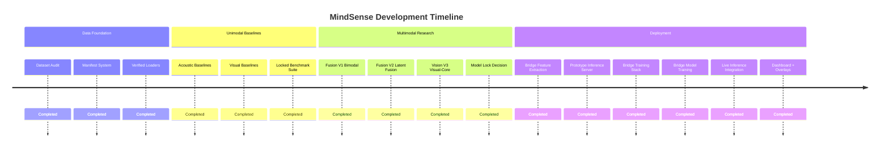
```mermaid
timeline
    title MindSense Development Timeline

    section Data Foundation
        Dataset Audit           : Completed
        Manifest System         : Completed
        Verified Loaders        : Completed

    section Unimodal Baselines
        Acoustic Baselines      : Completed
        Visual Baselines        : Completed
        Locked Benchmark Suite  : Completed

    section Multimodal Research
        Fusion V1 Bimodal       : Completed
        Fusion V2 Latent Fusion : Completed
        Vision V3 Visual-Core   : Completed
        Model Lock Decision     : Completed

    section Deployment
        Bridge Feature Extraction : Completed
        Prototype Inference Server : Completed
        Bridge Training Stack      : Completed
        Bridge Model Training      : Completed
        Live Inference Integration : Completed
        Dashboard + Overlays       : Completed
```

### Immediate Target

> Current focus: **production hardening and final demo readiness**.
>
> - camera source/backend reliability across machines
> - production-grade runtime controls and diagnostics
> - final dashboard UX cleanup on top of the server-owned video pipeline
> - final demo-ready repo snapshot with the hardened inference stack

#### Engineering Snapshot

<p align="center">
  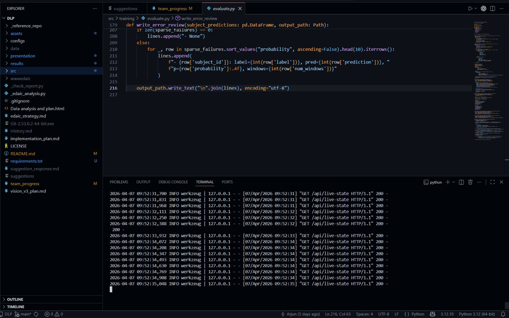
</p>
<p align="center">
  <em>Current hardening phase: live-state diagnostics, dashboard iteration, runtime tuning, and repo cleanup converging toward the final demo-ready snapshot.</em>
</p>

---

## ⚖️ Responsible Use

> [!CAUTION]
> This project is a **research and prototype system** for behavioral risk estimation. It is **not** a clinical diagnosis system, a substitute for professional evaluation, or a validated real-time mental health screening product.

The live layer remains intentionally conservative:

```
🌉  Bridge first
📊  Live prediction later
🤝  Honesty always
```

The system is designed to be explicit about:
- What the model is trained on vs. what the live demo uses
- Which parts are validated vs. exploratory
- Known failure modes and demographic limitations

---

## 📄 License

This project is licensed under the [MIT License](LICENSE).

---

<p align="center">
  <strong>MindSense</strong> — Evidence-led architecture selection. Benchmark-backed results. Honest deployment.
</p>

<p align="center">
  <sub>Built with discipline. Every phase earned. From audited data to vision-first winner.</sub>
</p>
